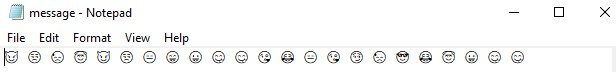

# Emoji
> diberikan sebuah kode untuk diterjemahkan

## About the Challenge
menerjemahkan emoji yang diberikan pada file message.txt



## Solution
Hint yang diberikan merupakan kode program untuk mengenkripsi text menjadi emoji, artinya kita akan mendkripsi kumpulan emoji.
Pada file message.txt, diberikan kumpulan emoji yang harus diterjemahkan untuk mendapat isi flag-nya.
Berikut fungsi dekripsi yang saya gunakan: <br />
```
def emojiToText(emojiText):
    text = ""
    emojis = emojiText.split()
    
    for emoji in emojis:
        if emoji.startswith("0x"):
            code = int(emoji, 16)
            if code >= 0x1F600 and code <= 0x1F64F:
                text += chr(code - 0x1F600 + ord("A"))
            else:
                text += emoji
        else:
            text += emoji
    
    return text
```
Kumpulan emoji pada file message.txt saya terjemahkan kedalam representasi kode unicode-nya dengan format 0x <br />
😇 - 0x1F607     😑 - 0x1F611 <br />
😈 - 0x1F608     😘 - 0x1F618 <br />
😒 - 0x1F612     😏 - 0x1F60F <br />
😑 - 0x1F611     😓 - 0x1F613 <br />
😄 - 0x1F604     😎 - 0x1F60E <br />
😀 - 0x1F600     😂 - 0x1F602 <br />
😋 - 0x1F60B     😇 - 0x1F607 <br />
😋 - 0x1F60B     😀 - 0x1F600 <br />
😘 - 0x1F618     😋 - 0x1F60B <br />
😂 - 0x1F602     😋 - 0x1F60B <br />

Kemundian diterjemahkan menggunakan fungsi dekripsi tadi
```
def emojiToText(emojiText):
    text = ""
    emojis = emojiText.split()
    
    for emoji in emojis:
        if emoji.startswith("0x"):
            code = int(emoji, 16)
            if code >= 0x1F600 and code <= 0x1F64F:
                text += chr(code - 0x1F600 + ord("A"))
            else:
                text += emoji
        else:
            text += emoji
    
    return text


emoji_text = "0x1F607 0x1F608 0x1F612 0x1F611 0x1F604 0x1F600 0x1F60B 0x1F60B 0x1F618 0x1F602 0x1F611 0x1F618 0x1F60F 0x1F613 0x1F60E 0x1F602 0x1F607 0x1F600 0x1F60B 0x1F60B"
text = emojiToText(emoji_text)

print("Emoji Text:", emoji_text)
print("Decoded Text:", text)

```
dan dipatkan isi dari pesan dekripsi untuk dimasukan dalam format ForestyHC{DECRYPTEDMESSAGE}
```
ForestyHC{HISREALLYCRYPTOCHALL}
```
