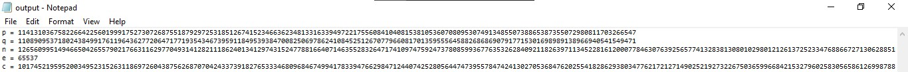

# RSA
> diberikan sebuah file berisi angka-angka untuk diterjemahkan dalam cipher RSA

## About the Challenge
menerjemahkan enkripsi yang diberikan dengan menggunakan nomor indikasi dari file output.txt yang diberikan




## Solution
Download file output.txt yang berisi nilai indikasi untuk diterjemahkan ke cipher RSA. 
Masukkan kumpulan yangka tersebut ke dalam RSA cipher berdasaarkan nilai indikasinya, yaitu p, q, n, e, c

```
ForestyHC{knowing_basic_of_RSA_calculation_1af53a}
```
