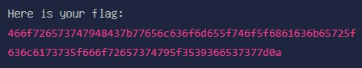

# Sanity Check
> menerjemahkan flag yang diberikan

## About the Challenge
diberikan sebuah kode untuk diterjemahkan



## Solution
Jika dilihat dari hint yang diberikan, kode tersebut telah di encode ke dalam format hex (hexadecimal).
Jadi, lakukan decode kode tersebut dari hex ke string.

```
ForestyHC{welcome_to_hacker_class_foresty_596e77}
```
