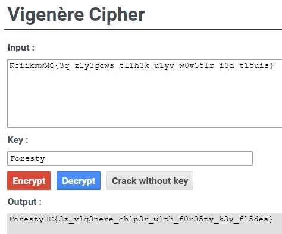

# Vigenere
> menerjemahkan flag yang diberikan dengan menggunakan key dari hint yang diberikan

## About the Challenge
diberikan sebuah kode untuk diterjemahkan dalam cipher Vigenere menggunakan key dari hint yang diberikan



## Solution
Diberikn flag yang sudah dienkripsi, KciikmwMQ{3q_z1y3gcws_tl1h3k_u1yv_w0v35lr_i3d_t15uis}.
Berdasarkan judul yang diberikan, enkripsi tersebut sepertinya menggunakan cipher Vigenere.
Untuk mendapatkan key yang dipakai, diberikan petunjuk yaitu 'Organizer dari Hacker Class'.
Saya menggunakan brute force dengan mencari nama setiap kakak panitia, sampai mencoba setiap huruf yang mengarah pada flag.
Ternyata, organizer yang dimaksud adalah Foresty

```
ForestyHC{3z_v1g3nere_ch1p3r_w1th_f0r35ty_k3y_f15dea}
```
