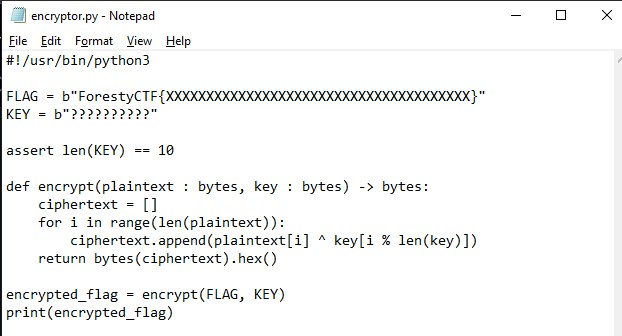

# Vigenere
> menerjemahkan enkripsi yang diberikan dengan menggunakan cipher Xor

## About the Challenge
diberikan sebuah ciphertext untuk diterjemahkan dalam cipher Xor berdasarkan file encryptor.py yang diberikan



## Solution
Diberikn ciphertext yang sudah dienkripsi, 
```
355c111740002628673f08580617432b36056c14425d072d6c0c6f196c10006c111745472d185a1b1f563c4055156e590704
```
Berdasarkan judul yang diberikan, enkripsi tersebut sepertinya menggunakan cipher Xor.
Pada file encryptor.py key yang digunakan itu 10 byte dengan key, yaitu ForestyCTF. 
Setelah didekripsi, akan mendapatkan s3cr3t_k3yN7tr0_OF8R�2uH�x�Z8VF�cr63T[�]Y9N%&a��SB, kemudian ambil 10 byte pertama, yaitu s3cr3t_k3y.
10 byte pertama tersebut akan menjadi key untuk dekripsi ciphertext yang diberikan dengan format flag yaitu ForestyCTF{flag}

```
ForestyCTF{keep_in_m1nd__x0r_is_rev3rsible_2fa124}
```
